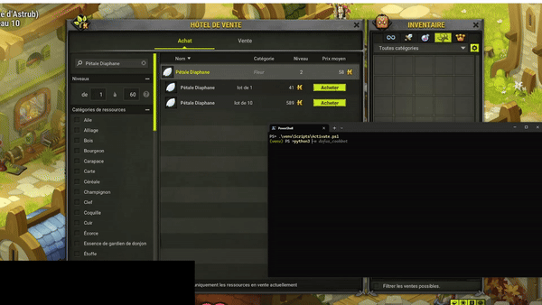
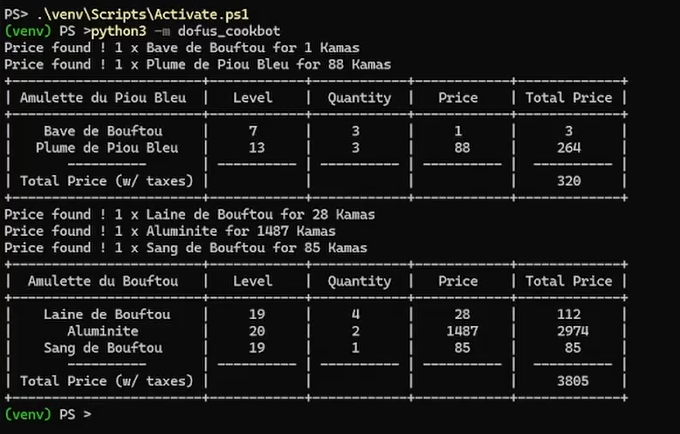

# Dofus Price Bot

* [Overview](#overview)
* [Demo](#demo)
    + [150% speed demo](#150%-speed-demo)
    + [Output example](#output-example)
* [Quick start](#quick-start)
* [Workflow](#workflow)
* [Features](#features)
* [Limits](#limits)
* [Troubleshooting](#troubleshooting)
    + [List selection bug](#list-selection-bug)
    + [Calibrate autoclick](#calibrate-autoclick)
    + [Recipe not found](#recipe-not-found)
    + [Run without building](run-without-building)
    + [Compatibility](#compatibility)
* [TODO](#todo)

## Overview

**Disclaimer:** this is a personnal project made with little Python knowledge. 
For better results, I recommend looking towards MITM Dofus bots.

This bot is a basic autoclicker that retrieve the price to craft an item.
It uses Tesseract OCR to read the price.
The goal is to check if it's worth it to buy every single material to craft the item or to buy it straigth on.

**Feel free to contribute !**

## Demo

### 150% speed demo



### Output example



## Quick start

Download and install [Tesseract OCR](https://tesseract-ocr.github.io/tessdoc/Downloads.html) from their website or [direct download](https://sourceforge.net/projects/tesseract-ocr-alt/files/tesseract-ocr-setup-3.02.02.exe/download).

```
git clone https://github.com/WildPasta/dofus-price-bot
cd dofus-price-bot
```

Locate tesseract.exe path and change path accordingly (in `dofus_cookbot\__main__.py`) for `pytesseract.pytesseract.tesseract_cmd = r'C:\\Users\\<username>\\AppData\\Local\\Programs\\Tesseract-OCR\\tesseract.exe'`

```powershell
python3 -m venv venv
source .\venv\Scripts\Activate.ps1
python3 -m pip install build
python3 -m build
python3 -m pip install .\dist\dofus_cookbot-1.1.0-py3-none-any.whl
python3 -m dofus_cookbot
```

## Workflow

1. Open the Market Place windows
2. Dofus cooker pops a GUI where you can select the items you want to craft
3. Once you're done, click OK
4. Wait until the bot end the clicking actions
5. Display ressource price in CLI

## Features

- Auto clicker
- API calls 
- Easy to use GUI
- Mouse position finder
- OCR

## Limits

I retrieve only the price of a single item so multi-buy can be worth it.

## Troubleshooting

### List selection bug

I am no tkinter professional so the list selection might select the wrong item.
You just have to click a second time on the desired entry to select it

### Calibrate autoclick

Screenshot capture zone and autoclick may not be 100% accurate.
You may want to update them manually by changing values in `dofus_cookbot\__main__.py`.
There is a helper to get mouse position in `utils\pos_finder\position_finder.py`.

### Recipe not found

The recipes were fetched from [DofAPI crawler](https://github.com/dofapi/crawlit-dofus-encyclopedia-parser) and all of the recipes may not be present.

The workaround here is that you can fetch items data with `utils\api\api.py` and manually fill the basic template here with your item data:

```json
[
    {
        "_id": 14076,
        "name": "Coiffe du Comte Harebourg",
        "type": "Chapeau",
        "lvl": "200",
        "recipe": [
            {
                "Galet brasillant": {
                    "id": "12740",
                    "lvl": "150",
                    "quantity": "3"
                }
            },
            {
                "Ethmoïde du Minotot": {
                    "id": "13168",
                    "lvl": "160",
                    "quantity": "12"
                }
            },
            {
                "Culotte de Harrogant": {
                    "id": "13914",
                    "lvl": "200",
                    "quantity": "5"
                }
            }
        ]
    }
]
```

### Run without building

It is possible to run the program without building it.
You first have to `python3 -m pip install -r reequirements.txt`.

Then change value of `recipe_file_path` in both `dofus_cookbot\__main__.py` and `dofus_cookbot\gui\gui.py` to match location of `dofus_cookbot\res\equipment_recipes.json`.

### Compatibility

Tested on Windows 10 with Dofus 2.71.6.8 

## TODO

- [X] Adapt screen size to any client
- [X] Clean imported library
- [x] Implement error handling
- [X] Improve project folders structure
- [x] Create a wheel using setuptools
- [ ] Retrieve the price of multi-buy
- [ ] Add item level selection to reduce errors
- [ ] Implement logging system
